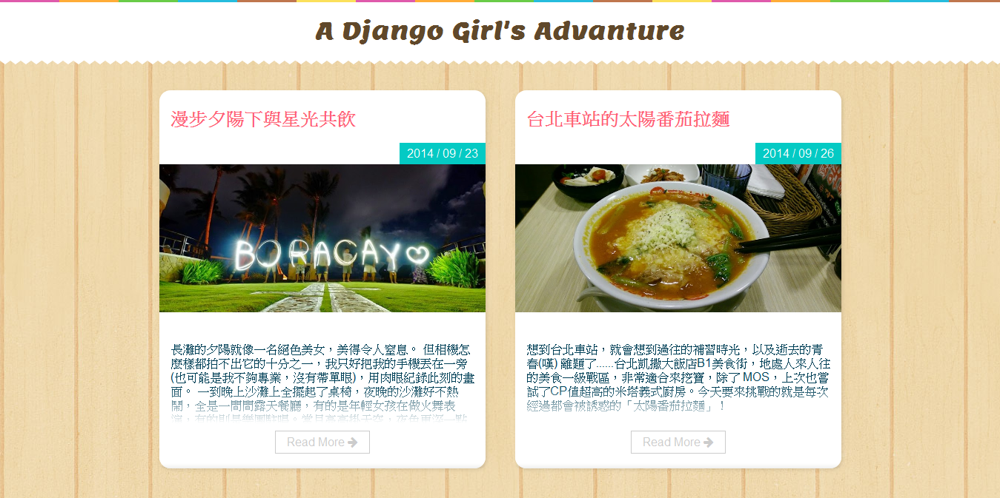

# Django Girls 學習指南

這份學習指南適合所有 Django 初學者，為了更好的學習效果，我們希望你能具備：
- Web 的初步認識
- 了解如何使用 Command Line
- 略懂 Python 基礎語法
- 看得懂簡單的 HTML / CSS

## 學習前準備
在使用這份指南前，請先準備好：
1. [安裝 Python 3.4](http://djangogirlstaipei.herokuapp.com/tutorials/installation/)
2. [安裝 Git](http://djangogirlstaipei.herokuapp.com/tutorials/installation/)
3. [Heroku 註冊與安裝設定](http://djangogirlstaipei.herokuapp.com/tutorials/setting-up-heroku/)

## 學習範例

透過這份學習指南，你會學習到 Django 的程式架構，從創建一個專案，到最後將網站發佈到網路上，建立一個屬於自己的**旅遊日記**。

### 旅遊日記首頁

### 旅遊日記 - 單篇日記頁面

