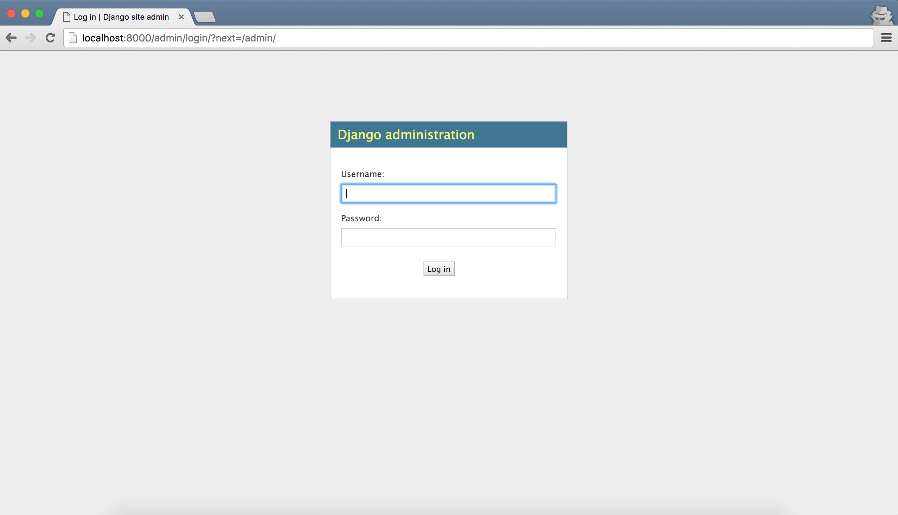
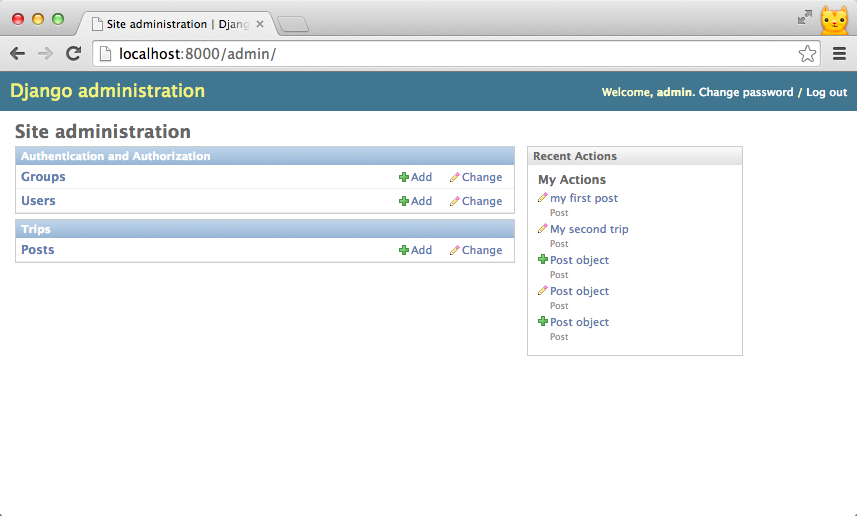
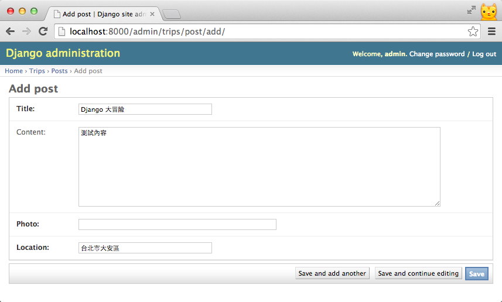

# Admin

雖然在前一章，透過 Django Shell 和 QuerySet API，你可以新增、修改及刪除你的 Post，但其實 Django 提供了其他輕量型 Web Framework 沒有的強大功能 [Django Admin](https://docs.djangoproject.com/en/dev/ref/contrib/admin/) - 後台管理介面，讓你可以直接透過它進行資料庫操作。

## 後台管理設定

Django 在預設會開啟後台管理的功能，因此，你可以看到在`INSTALLED_APPS`裡已經有 'django.contrib.admin' 這個 app ，當你在同步資料庫時，也會創建後台管理需要的資料表及欄位：

```
# mysite/settings.py

INSTALLED_APPS = (
    'django.contrib.admin',
    ...
)
```

為了讓你可以從瀏覽器連接到後台管理介面，Django 在預設指定 `/admin/` 對應到其相關的 urls：

```
# mysite/urls.py

from django.contrib import admin
admin.autodiscover()

urlpatterns = pattern('',
    ...
    url(r'^admin/', include(admin.site.urls)),
)
```

## 註冊 Model class

最後，我們需要在 Django app 裡的 admin.py 註冊你的 Model:

```
# trips/admin.py

from django.contrib import admin
from trips.models import Post

admin.site.register(Post)

```
現在，讓我們在瀏覽器輸入 [http://localhost:8000/admin](http://localhost:8000/admin)，你會看到後台管理的登入頁面：



請輸入你在第一次同步資料庫時創造的 superuser 帳號密碼，進入後台管理首頁 ：

管理介面首頁 screenshot


除了剛剛註冊的 Model，預設你還可以在這裡管理使用者 ( User ) 和 群組 ( Group ) ，你可以試著利用後台管理介面新增一筆 Post：


