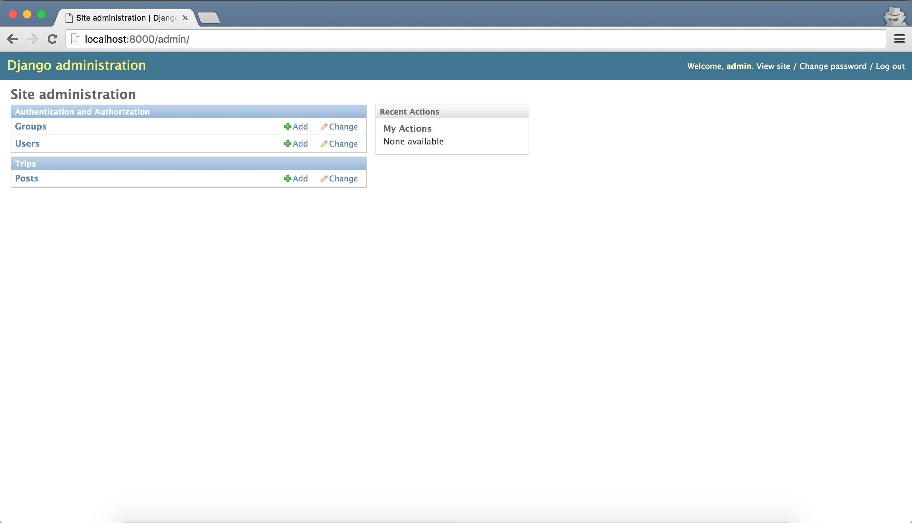
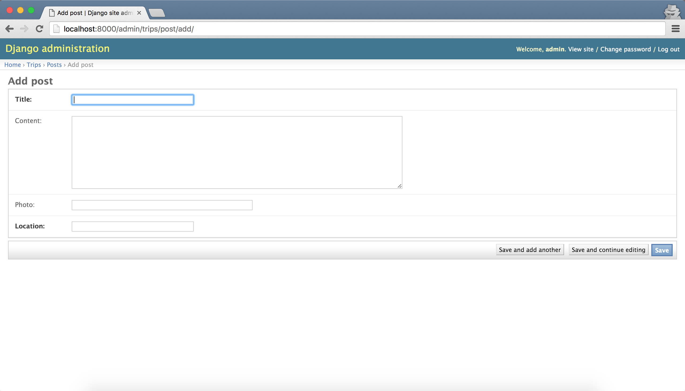
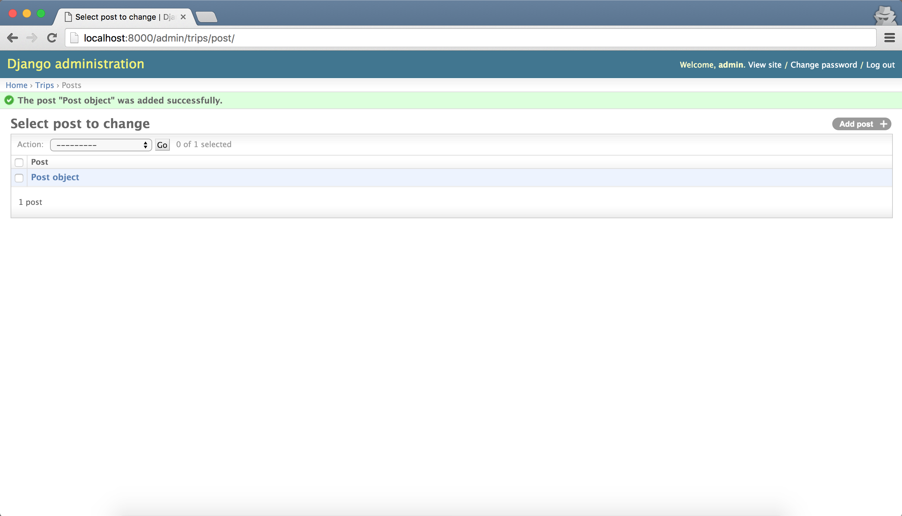
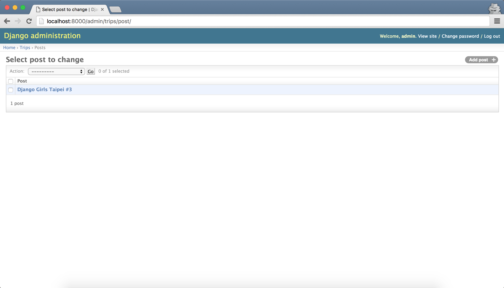

# Admin

大部份網站都設計有管理後台，讓管理者方便新增或異動網站內容。

而這樣的管理後台，Django 也有內建一個 App — [**Django Admin**](https://docs.djangoproject.com/en/1.11/ref/contrib/admin/) 。只需要稍微設定，網站就能擁有管理後台功能。

前一章，我們學到如何使用 Django Model 抽象地表達資料庫結構。現在，我們要透過 **Django Admin** 看到實際的資料，並跟資料庫進行互動。

---

完成本章後，你會瞭解如何設定 Django Admin，並使用 Django 管理後台，完成 Post 的新增、修改及刪除。

---

## 設定管理後台

### 將 Django Admin 加入 `INSTALLED_APPS`

後台管理的功能 Django 已預設開啟。因此，設定檔中的 `INSTALLED_APPS` 裡，已經有 `django.contrib.admin` 這個 app ：

```
# mysite/settings.py

INSTALLED_APPS = [
    'django.contrib.admin',
    ...
]
```

當你在同步資料庫時，也會建立需要的資料表及欄位。

### 設定管理後台的 URL

為了讓你可以從瀏覽器進入管理後台，我們需要設定對應的 URL patterns。

我們將管理後台的網址設定為 `/admin/`。確認 `mysite/urls.py` 中的 `urlpatterns` 包含下面這行：

```
url(r'^admin/', admin.site.urls),
```

## 建立 superuser

要使用 Django 的管理後台，需要一個管理員帳號。

使用 [createsuperuser](https://docs.djangoproject.com/en/1.11/ref/django-admin/#django-admin-createsuperuser) 這個指令，建立一個 superuser：

```
(djangogirls_venv) ~/djangogirls/mysite$ python manage.py createsuperuser
Username (leave blank to use 'YOUR_NAME'):
Email address: your_name@yourmail.com
Password:
Password (again):
Superuser created successfully.

```
輸入帳號、Email、密碼等資訊，就完成 superuser 的新增了。


## 註冊 Model class

最後，我們需要在讓 Django 知道，有哪些 Model 需要管理後台。

修改 **trips** app 裡的 `admin.py`，並註冊 **Post** 這個 model：

```python
# trips/admin.py

from django.contrib import admin
from .models import Post


admin.site.register(Post)
```

## 使用管理後台

### 進入管理後台

連至 [http://127.0.0.1:8000/admin](http://127.0.0.1:8000/admin)，可以看到管理後台的登入頁面：


請輸入你剛創立的 superuser 帳號密碼，進入管理後台：

第一個區塊 **Authentication and Authorization** ，可以管理使用者（User）和 群組（Group）；第二個 **Trips** 區塊裡，則可以看到剛剛設定的 Post model。在這裡可以執行 Post 的新增、修改、刪除等功能。




### 新增一個 Post

現在試著建立一個新的 Post 看看：



建立成功後會回到 Posts 頁面，你會發現有一筆資料顯示為 `Post object`：



---

Django 通常以 `Post object` 來表示 Post 物件，但此種顯示不易辨別。我們可以透過 [`def __str__`](https://docs.djangoproject.com/en/1.11/ref/models/instances/#str)  更改 Post 的表示方式。

修改 `trips/models.py`：

```python
# trips/models.py

from django.db import models


class Post(models.Model):
    ...
    created_at = models.DateTimeField(auto_now_add=True)

    def __str__(self):
        return self.title
```

重新整理 Posts 頁面後，Post 已經被定義成顯示標題：


---

## 小結

你現在己經學會：

- 設定 Django Admin
- 建立 superuser
- 註冊 Model 至 Admin

---

本章新學到的指令

| 指令| 說明 |
| ---|--- |
| python manage.py **createsuperuser** | 新增 Django 管理者帳號 |

