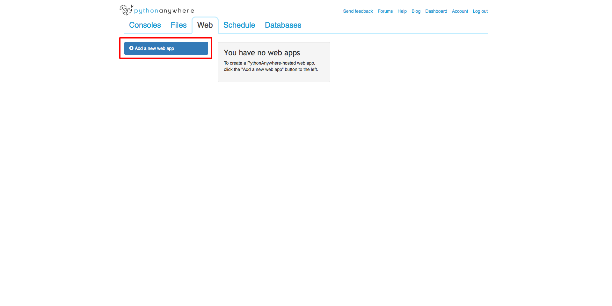

# # Deploy

目前為止，我們所有的工作都是在自己的電腦完成，你可以在自己的瀏覽器上看到成果。但是，如果我們想要讓其他使用者使用這個網站，就必須將它部署（deploy）到穩定的伺服器上，才能隨時瀏覽。

---

我們選擇 [PythonAnywhere](https://www.PythonAnywhere.com/) 作為這次的範例，它對於 Python 的支援性相當好，免費帳號也足夠經營一個小型網站。

---

## 部署準備

為了將你的程式碼上傳到雲端，我們要先將整個專案包成一個壓縮檔。

### zip

在 `djangogirls` 專案目錄底下，利用以下的指令將整個專案打包成`mysite.zip`檔案：

```
(djangogirls_venv) ~/djangogirls$ python -m zipfile -c mysite.zip mysite
```


## 部署到雲端

在開始部署（deploy）之前，請先確定你已經註冊 [PythonAnywhere](https://www.PythonAnywhere.com/)：


### Step 1: 上傳專案 zip 檔


這一個步驟將使用 PythonAnywhere 的檔案介面，請切換到 **Files** 分頁，你會發現一個`Upload a file`的按鈕：


按下按鈕選擇你剛剛壓縮好的`mysite.zip`，當畫面上出現你的檔案時，表示已經上傳完成了。


### Step 2: 開啟 Bash console

切換到 **Consoles** 分頁，點選 `Bash` 開啟一個新的 Bash console，讓我們可以透過它下指令建置部署環境。


首先，利用`unzip`的指令，解壓縮檔案：

```
~ $ unzip mysite.zip
```


接下來，由於雲端的環境與我們本機端不同，我們還是要創建一個虛擬環境，並安裝 Django：

```
~ $ virtualenv --python=python3.5 djangogirls_venv
~ $ source djangogirls_venv/bin/activate
(djangogirls_venv) ~ $ pip install "django<1.9"

```


### Step 3: 新增一個新的 web app

點擊左上角的 logo 回到主頁面，切換到 **Web** 分頁後，請點選`Add a new web app`按鈕：



你會看到一個新視窗，由於免費版的無法設定 domain name，這裡直接按下`Next`即可。


在選擇 Python Web framework 時，請特別注意**不要選擇 Django**。我們需要手動設定虛擬環境，請選擇`Manual configuration`。


Python 的版本請選擇`Python 3.5`。


直接按下`Next`，完成創建 web app 的程序。


### Step 4: 修改 web app 設定

當你完成上一個步驟後，**Web** 分頁會出現 web app 的設定介面，你可以夠過此介面修改設定、重載 web app、或是查看錯誤訊息等等。


在`Virtualenv`區塊，填入你的虛擬環境位置`/home/<your-PythonAnywhere-username>/djangogirls_venv`，並點選按鈕儲存設定。


[WSGI - Web Server Gateway Interface](http://webpython.codepoint.net/wsgi_tutorial) 是 Python 定義網頁程式和伺服器溝通的介面。

為了讓 PythonAnywhere 的服務能夠透過這個介面與我們的網站溝通，在`Code`區塊點選 `/var/www/<your-PythonAnywhere-username>_PythonAnywhere_com_wsgi.py`：


刪除原有的程式碼，並覆蓋為：

```
import os
import sys

path = '/home/<your-PythonAnywhere-username>/mysite'  # use your own PythonAnywhere username here
if path not in sys.path:
    sys.path.append(path)

os.environ['DJANGO_SETTINGS_MODULE'] = 'mysite.settings'

from django.core.wsgi import get_wsgi_application
from django.contrib.staticfiles.handlers import StaticFilesHandler
application = StaticFilesHandler(get_wsgi_application())
```

記得要將 `<your-PythonAnywhere-username>` 改成你在 PythonAnywhere 註冊的 *username*。

點選`Save`儲存你的修改後，回到上一頁。


### Step 5: 重新載入（Reload）web app

點選`Reload`按鈕，重新載入我們更新的設定：


### Step 6: 開啟瀏覽器觀看你的網站

最後，你可以直接點選網址在瀏覽器打開你的網站：


恭喜你成功地把網站發佈到網路上了！


你可以分享網址給任何人：<https://djangogirlstaipei.PythonAnywhere.com/>。記得前面要替換成你自己的 PythonAnywhere `username`！

---

未來如果對網站進行任何修改並想更新到 PythonAnywhere，只要壓縮整個專案並上傳，再用 Bash console 解壓縮即可。

---
