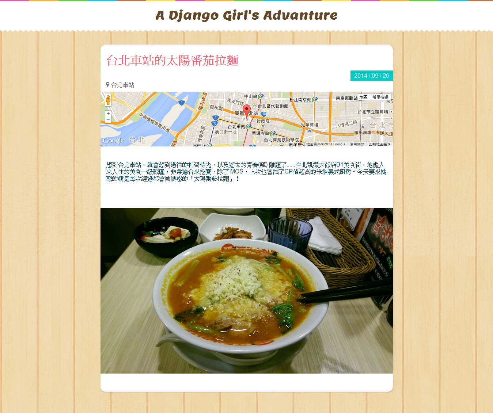

# Dynamic URL


除了在首頁顯示文章的摘要外，通常也會希望每篇文章能有獨立的網址與頁面。例如，我們可能會希望 `http://127.0.0.1/post/5` 能夠是 **id=5 **那篇文章的網址，而頁面內容則是此篇日記的詳細資訊，而非摘要。

---

在這個章節，我們會學到如何設定動態網址的 URLConf。讓每篇旅遊日記，擁有獨一無二的網址與頁面。

---

## 建立單篇文章的 View

首先建立單篇文章所使用的 View Function。在 *trips/views.py* 中新增 **post_detail** 這個 View 如下：

```python
# trips/views.py

def post_detail(request, id):
    post = Post.objects.get(id=id)
    return render(request, 'post.html', {'post': post})
```


> 我們以訪客瀏覽 `http://127.0.0.1:8000/post/5` 的例子，來解釋以上程式：


- ** 目前瀏覽文章的 id 會傳入 View 中：** 當訪客瀏覽 `http://127.0.0.1/post/5` 時，傳入 View 的 id 會是 5。

    - URL 與 id 的對應，會在稍後設定。這裡只需知道 View 中傳入的，會是當前瀏覽文章 id 即可。

- ** 取得傳入 id 的那篇 Post 資料：** 當傳入的 id=5，代表訪客想看到 id=5 那篇文章。我們可以利用之前學過的 ORM 語法 `get`， 取得該篇日記的 **Post** 物件：

    ```python
    post = Post.objects.get(id=id) # 此時 id = 5
    ```
- ** 回傳 HttpResponse：** 將取得的 post ( *id=5* ) 傳入 Template *( post.html )*，並呈現 Render 後的結果。

## 設定動態網址的對應

日記單頁的 View Function 完成後，我們來設定網址與 View 的對應。修改 *mysite/urls.py* ，加入以下內容：

```python
# mysite/urls.py

urlpatterns = patterns('',
    ...
    url(r'^post/(?P<id>\d+)/$', 'trips.views.post_detail',
        name='post_detail'),
)
```

上面的修改完成後，只要連至`http://127.0.0.1/post/5` 就會對應到  `post_detail()` 這個 View，並且**傳入的 id = 5** 。

---
### 使用 Regex 提取部份 URL 為參數

我們前面提過，Django 的 URL 是一個 *Regular Expression (Regex)*。Regular expression 可用來描述一個字串的樣式。 除了可以表示固定字串之外，還可以用來表示不確定的內容。我們一步一步解釋文章單頁所使用的 Url 設定：

```
(?P<id>\d+)
```

1. `\d` 代表一個阿拉伯數字。

2. `+` 代表「一個以上」。

    所以 `\d+` 代表一個以上的阿拉伯數字，例如「0」、「99」、「12345」。可是像「8a」就不符合，因為「a」不是數字。

3. `(?P<id>)` 代表「把這一串東西抓出來，命名為 id。

    所以 `(?P<id>\d+)` 代表：抓出一個以上阿拉伯數字，並把抓出來的東西取名為 id。

所以 `r'^post/(?P<id>\d+)/$'` 會達成以下的效果：

URL       | 符合結果
----------|------------------------
http://127.0.0.1/<strong>posts/</strong>    | 不符合，因為前面不是 **post/** 開頭。
http://127.0.0.1/<strong>post/</strong>     | 不符合，因為後面抓不到數字。
http://127.0.0.1/<strong>post/1/</strong>   | 符合，抓到的 id 是 1。
http://127.0.0.1/<strong>post/1234/</strong>| 符合，抓到的 id 是 1234。
http://127.0.0.1/<strong>post/12ab/</strong>| 不符合，因為後面有不是數字的東西。
---

## 建立單篇日記頁的 Template

回顧一下之前寫的 View Function ( *post_detail* ) 的內容
```python
return render(request, 'post.html', {'post': post})
```
我們取得所需 post 物件後，傳入 `post.html` 這個 template 中 render，現在我們就來完成這個 Template。建立 *post.html* 如下：

```html
<!-- templates/post.html -->

<!DOCTYPE html>
<html>
<head>
    <meta charset="utf-8">
    <title>A Django Girl's Adventure</title>
    <link href='http://fonts.googleapis.com/css?family=Lemon' rel='stylesheet' type='text/css'>
    <link href="//maxcdn.bootstrapcdn.com/font-awesome/4.2.0/css/font-awesome.min.css" rel="stylesheet">
    <link href="http://djangogirlstaipei.github.io/assets/css/style.css" rel=stylesheet>
</head>
<body>
    <div class="header">
        <h1 class="site-title text-center">
            <a href="/">A Django Girl's Adventure</a>
        </h1>
    </div>
    <div class="container post post-detail">
        <div class="post-heading">
            <h1 class="title"><a href="">{{ post.title }}</a>
            </h1>
            <div class="date">{{ post.created_at|date:'Y / m / d' }}</div>
        </div>
        <div class="location">
            <i class="fa fa-map-marker"></i>
            <span id="location-content">{{ post.location }}</span>
        </div>
        <div id="map-canvas" class="map"></div>
        <div class="post-content">
            {{ post.content }}
        </div>
        <hr class="fancy-line">
        
    </div>
    <script src="https://maps.googleapis.com/maps/api/js?v=3.exp"></script>
    <script src="http://djangogirlstaipei.github.io/assets/js/map.js"></script>
</body>
</html>
```

**說明：**

- 將 post 物件的屬性 (e.g. 標題、內文、時間......等)，利用 `{{ var }}` 與 Template Filter 顯示並格式化於 HTML 中

- 若資料庫裡有 id=5 的 Post，現在連至 http://127.0.0.1:8000/post/5 即可看到此日記的單頁

## 加入到單篇日記頁的連結

最後，我們還需在首頁加上單篇日記的連結。我們可以使用 ``這個 Template Tag 達成，需要加入的地方有：
1. 每篇日記的標題
2. 每篇日記的 Read More 按鈕

---

##### 

連結到特定 View 的 Template Tag

使用方法：

| 語法 | 說明 |
| -- | -- |
|  | 使用 View 的路徑 |
|  | 使用在 urls.py 中設定的 name  |

也可以傳入參數，如：
```


```

其餘用法可參考 [Template Tag:  **url**](https://docs.djangoproject.com/en/1.7/ref/templates/builtins/#url)

---

現在我們開始加入詳細頁的連結，需要加入的地方有
1. 每篇日記
2. 每篇日記的 Read More 按鈕

#### 設定標題連結
打開 *home.html*，找到下面的內容：

```html
<!-- home.html -->

<h2 class="title">
    <a href="#">{{ post.title }}</a>
</h2>
```

將它改成

```html
<!-- home.html -->

<h2 class="title">
    <a href="">{{ post.title }}</a>
</h2>
```

#### 設定 Read More 按鈕的連結


在 *home.html* 中找到以下內容：

```html
<!-- home.html -->

<a class="read-more" href="#">
    Read More <i class="fa fa-arrow-right"></i>
</a>
```

修改如下：

```html
<!-- home.html -->

<a class="read-more" href="">
    Read More <i class="fa fa-arrow-right"></i>
</a>
```

### 驗收成果

連至 http://127.0.0.1:8000/ ，現在只要點擊各個日記的標題或 **Read more** 按鈕，就會顯示那該篇日記的詳細頁面。


