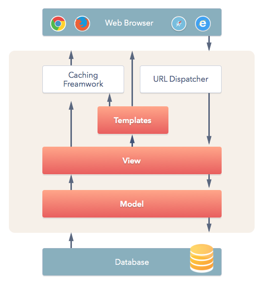

# Django 介紹

[Django](https://www.djangoproject.com/) (/ˈdʒæŋɡoʊ/ jang-goh) 可以說是 Python 最著名的 Web Framework，一些知名的網站如 [Pinterest](http://www.pinterest.com/), [Instagram](http://instagram.com), [Disqus](https://disqus.com/) 等等都使用過它來開發。

它有以下的特色：
- 免費開放原始碼
- 著重快速開發、高效能
- 遵從 [DRY ( Don't Repeat Yourself )](http://c2.com/cgi/wiki?DontRepeatYourself) 守則，致力於淺顯易懂和優雅的程式碼
- 使用類似 Model–view–controller (MVC) pattern 的架構

## Web Framework

Web framework，簡單來說就是當你開發 Web 應用程式時所用的框架。它通常會提供：
1. **一個既定的程式骨架**  -- 你必須按照它的規範寫程式，例如把資料庫相關的程式與跟畫面溝通的程式分開，而不是全部寫在同一個檔案。這對於程式的開發速度、再利用性、和程式可讀性等等都有相當大的好處。
2. **強大且豐富的函式庫 ( Libraries )** -- 通常會提供一些開發網站所需要且常用的功能，例如使用者認證、安全機制、URL mapping、資料庫連接等等。讓你在開發網站時可以直接使用函式庫，然後專注在客製化自己的功能。

## Django 的 架構

如同一些比較著名的 Web framework，Django 同樣也使用了類似 MVC 的架構，只是在定義和解釋上略為不同，稱為 MTV ( Model–Template–View )，我們可以透過下面這張圖來了解其運作方式：

