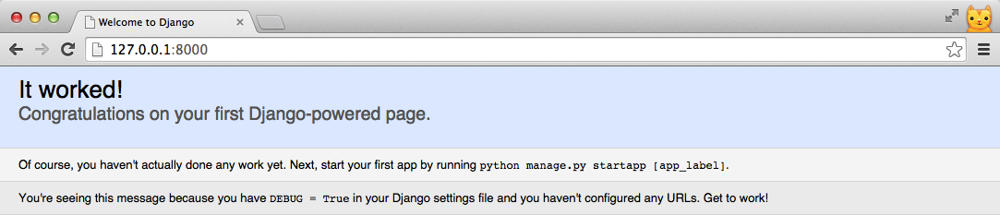

# Project and apps

每一個 Django project 裡面可以有多個 Django app，可以想成是類似模組的概念。在實務上，**通常會依功能分成不同 app**，方便未來的維護和重複使用。

例如，我們要做一個類似 Facebook 這種網站時，依功能可能會有以下 App：

- 使用者管理 -- account
- 好友管理 -- friend
- 塗鴉牆管理 -- timeline
- 動態消息管理 -- feed

若未來我們需要寫個購物網站，而需要會員功能時，`account app` (使用者管理) 就可以被重複使用。

---

這一章，你會學到如何使用 Django 命令列工具建立 Django project 和一個 Django app。

---

## 建立 Django project

### 建立專案資料夾 -- startproject
首先，使用 `django-admin.py` 來建立第一個 Django project `mysite`:
```
django-admin.py startproject mysite
```

此時會多了一個 **mysite** 資料夾，我們切換進去
```
cd mysite
```

`startproject` 這個 Django 指令除了建立專案資料夾，也預設會建立一些常用檔案，你可以使用 `ls` 或 `dir /w` (Windows) 檢視檔案結構。

目前 project 的檔案結構如下:

```
mysite/
├── mysite
│   ├── __init__.py
│   ├── settings.py
│   ├── urls.py
│   └── wsgi.py
└── manage.py
```


### 瞭解 Django Command
`manage.py`是 Django 提供的命令列工具，我們可以利用它執行很多工作，例如同步資料庫、建立 app 等等，指令的使用方式如下:
```
python manage.py <command> [options]
```
如果你想要了解有什麼指令可以使用，輸入`help`或`-h`指令會列出所有指令列表:
```
python manage.py -h
```
而如果想了解其中一個指令，可以在指令名字後輸入`-h`，你會看到簡單的的指令介紹以及用法說明，以`runserver`為例：
```
(VENV) ~/djangogirls/mysite$ python manage.py runserver -h
Usage: manage.py runserver [options] [optional port number, or ipaddr:port]

Starts a lightweight Web server for development and also serves static files.

Options:
  -v VERBOSITY, --verbosity=VERBOSITY
                        Verbosity level; 0=minimal output, 1=normal output,
                        2=verbose output, 3=very verbose output
  --settings=SETTINGS   The Python path to a settings module, e.g.
                        "myproject.settings.main". If this isn't provided, the
                        DJANGO_SETTINGS_MODULE environment variable will be
                        used.
  --pythonpath=PYTHONPATH
                        A directory to add to the Python path, e.g.
                        "/home/djangoprojects/myproject".
  --traceback           Raise on exception
  --no-color            Don't colorize the command output.
  -6, --ipv6            Tells Django to use an IPv6 address.
  --nothreading         Tells Django to NOT use threading.
  --noreload            Tells Django to NOT use the auto-reloader.
  --nostatic            Tells Django to NOT automatically serve static files
                        at STATIC_URL.
  --insecure            Allows serving static files even if DEBUG is False.
  --version             show program's version number and exit
  -h, --help            show this help message and exit


```
### 啟動開發伺服器 -- runserver

從說明中可以知道，`runserver`會啟動一個簡單的 web server，方便於在開發階段使用：
```
(VENV) ~/djangogirls/mysite$ python manage.py runserver
...
Django version 1.7, using settings 'mysite.settings'
Starting development server at http://127.0.0.1:8000/
Quit the server with CTRL-BREAK.
```
現在打開瀏覽器輸入 [http://127.0.0.1:8000/](http://127.0.0.1:8000/) 或是 [http://localhost:8000/](http://localhost:8000/) 會看到你的 django 專案已成功在 web server 上執行




最後我們可以按下 `CTRL+C` ，關閉 web server 回到命令列。

---

如果無法看到成功畫面，並且命令列上顯示錯誤訊息 - " *django.db.utils.OperationalError: no such table: django_session*"，請輸入：
```
(VENV) ~/djangogirls/mysite$ python manage.py migrate
```
然後再次`runserver`啟動你的 web server，我們會在 **Django Models** 解釋`migrate`的作用。

---

## 建立 Django application (app)

現在，讓我們利用 `startapp` 建立第一個 Django app -- **trip**:
```
python manage.py startapp trip
```
`startapp`會按照你的命名建立一個同名資料夾和 app 預設的檔案結構如下：
```
trip
├── __init__.py
├── admin.py
├── migrations
├── models.py
├── tests.py
└── views.py

```

## 小結

目前為止，我們使用 `startproject` 建立了一個名為 **mysite** 的 django 專案，和一個名為 ** trip**
 的 django app
```
mysite
├── mysite
│   ├── __init__.py
│   ├── settings.py
│   ├── urls.py
│   └── wsgi.py
├── trip
│   ├── __init__.py
│   ├── admin.py
│   ├── migrations
│   ├── models.py
│   ├── tests.py
│   └── views.py
└── manage.py
```

---

最後，我們回顧一下本章學到的指令

| 指令 | 說明 |
| ---|--- |
| django-admin.py **startproject** *`<project_name>`* | 建立 django 專案 |
| python manage.py **-h** *`<command_name>`* | 查看 django command 的使用方法 |
| python manage.py **runserver** | 啟動開發伺服器 |
| python manage.py **startapp** *`<app_name>`*  | 新增 django app |

---

