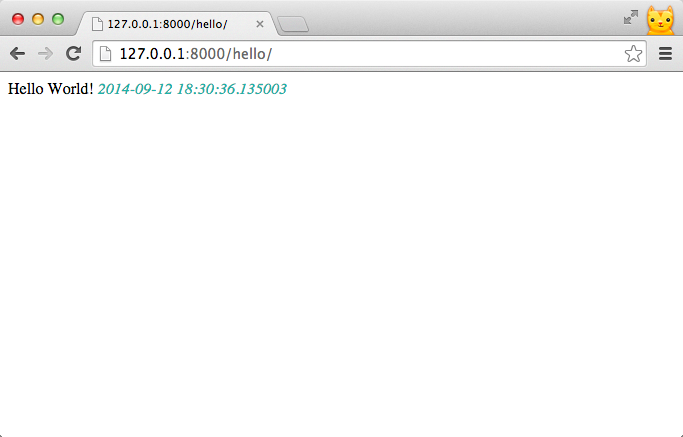

# Templates

## 加上 HTML / CSS & 動態內容

上一章的例子，只是很簡單的顯示一行字串。讓我們加上一些 HTML/CSS 美化網頁，並動態顯示每次進來這個頁面的時間:

```
# trip/views.py

from datetime import datetime
from django.http import HttpResponse


def hello_world(request):
    output = """
        <!DOCTYPE html>
        <html>
            <head>
            </head>
            <body>
                Hello World! <em style="color:LightSeaGreen;">{current_time}</em>
            </body>
        </html>
    """.format(current_time=datetime.now())

    return HttpResponse(output)
```

1. **多行字串：**

    `"""..."""` 或是 `'''...'''` (三個雙引號或三個單引號) 是字串的多行寫法，這裡我們使用它表達 HTML，並維持原有的縮排。
2. **顯示目前時間：**

    為了顯示動態內容，我們 import [datetime](https://docs.python.org/3/library/datetime.html) 時間模組，並用`datetime.now()`取得現在的時間。

3. **字串格式化：**

    使用 [format()](https://docs.python.org/3/library/string.html#string-formatting) 格式化字串，將 datetime.now() 產生的值，代入 `{current_time}` 在字串中的位置。

---

現在啟動 web server ，連至 [http://127.0.0.1:8000/hello/](http://127.0.0.1:8000/hello/) 後，會發現網頁不再是純文字。除了加上了一些樣式外，也會顯示當下的時間。

*你可以重新整理網頁，試試看時間有沒有改變*




## 第一個 Template

在前一個例子，我們把 HTML/CSS 放在 View function 裡。但在實務上，我們會將前端的程式碼獨立出來，放在 templates 資料夾裡。不僅增加可讀性，也方便與設計師或前端工程師分工。

###  Template 資料夾

首先建立 Template 資料夾。開啟終端機 *(如果不想關閉 web server，可以再開新一個新的終端機視窗)*，並確認目前所在位置為 `djangogirls/mysite/`。

新增一個名為 `templates` 的資料夾`：

```
mkdir templates
```

### 設定 Templates 資料夾的位置

建立好資料夾以後，我們需要修改`mysite/settings.py`，加上`TEMPLATE_DIRS`：

```python
# mysite/settings.py

TEMPLATE_DIRS = (
    os.path.join(BASE_DIR, 'templates').replace('\\', '/'),
)
```


### 建立第一個 Template
新增檔案 `templates/hello_world.html` ，並將之前寫在 View function 中的 HTML 複製到 `hello_world.html`
```
├── mysite
├── templates
│   └── hello_world.html
├── trip
└── manage.py
```

為了區別，我們做了一些樣式上的調整：
```
<!DOCTYPE html>
<html>
    <head>
        <title>I come from template!!</title>
        <style>
            body {
               background-color: lightyellow;
            }
            em {
                color: LightSeaGreen;
            }
        </style>
    </head>
    <body>
        <h1>Hello World!</h1>
        <em>{{ current_time }}</em>
    </body>
</html>

```

#### 在 Template 中顯示變數
以上 Template 中，有個地方要特別注意：

    <em>{{ current_time }}<em>

仔細比較，可以發現變數 **current_time** 的使用方式與之前不同，在這裡用的是兩個大括號。

---

`{{`*`<variable_name>`*`}}` 是在 Django Template 中顯示變數的語法。

---

*其它 Django Template 語法，我們會在後面的章節陸續練習到*。


## render

最後，將 **hello_world** 修改如下：

```
# trip/views.py

from datetime import datetime
from django.shortcuts import render


def hello_world(request):
    return render(request,
                  'hello_world.html',
                  {'current_time': datetime.now()})
```

我們改成用 `render` 這個 function 產生要回傳的 HttpResponse 物件。

這次傳入的參數有：

 - **request** --  HttpRequest 物件
 - **template_name** -- 要使用的 Template
 - **dictionary** -- 包含要新增至 Template 的變數

---
**Render** ：產生 HttpResponse 物件。

[render(request, template_name, dictionary)](https://docs.djangoproject.com/en/dev/topics/http/shortcuts/#render)

---


#### 大功告成

HTML 程式碼獨立成 Template 後，程式也變得簡潔許多了。

重新載入 [http://127.0.0.1:8000/hello/](http://127.0.0.1:8000/hello/)，你會發現畫面有了小小的改變：


