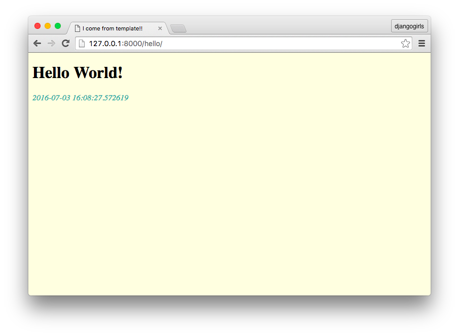

# Templates

上一章的例子，只是很簡單的顯示一行字串。
現在，讓我們加上一些 HTML/CSS 美化網頁，並動態顯示每次進來這個頁面的時間。

## 第一個 Template

實務上，我們會將前端的程式碼獨立出來，放在 templates 資料夾裡。不僅增加可讀性，也方便與設計師或前端工程師分工。

###  Template 資料夾

首先建立 Template 資料夾。開啟終端機 *(如果不想關閉 web server，可以再開新一個新的終端機視窗)*，並確認目前所在位置為 `djangogirls/mysite/`。

新增一個名為 `templates` 的資料夾`：

```
(djangogirls_venv) ~/djangogirls/mysite$ mkdir templates
```

### 設定 Templates 資料夾的位置

建立好資料夾以後，我們需要修改 `mysite/settings.py` 中的 `TEMPLATES` 設定：

```python
# mysite/settings.py

TEMPLATES = [
    {
        'BACKEND': 'django.template.backends.django.DjangoTemplates',
        'DIRS': [os.path.join(BASE_DIR, 'templates')],
        'APP_DIRS': True,
        'OPTIONS': {
            'context_processors': [
                'django.template.context_processors.debug',
                'django.template.context_processors.request',
                'django.contrib.auth.context_processors.auth',
                'django.contrib.messages.context_processors.messages',
            ],
        },
    },
]
```

我們將 `'DIRS'` 原本的`[]`修改成：

```python
[os.path.join(BASE_DIR, 'templates')]
```

好讓 Django 找得到剛剛建立的 `templates` 資料夾。


### 建立第一個 Template

新增檔案 `templates/hello_world.html`：

```
mysite
├── mysite
├── templates
│   └── hello_world.html
├── trips
└── manage.py
```

並將下列的 HTML 複製到 `hello_world.html`：

```html
<!-- hello_world.html -->

<!DOCTYPE html>
<html>
    <head>
        <title>I come from template!!</title>
        <style>
            body {
               background-color: lightyellow;
            }
            em {
                color: LightSeaGreen;
            }
        </style>
    </head>
    <body>
        <h1>Hello World!</h1>
        <em>{{ current_time }}</em>
    </body>
</html>
```

#### 在 Template 中顯示變數

以上 Template 中，有個地方要特別注意：

    <em>{{ current_time }}</em>

在 Template 裡面．我們會使用兩個大括號，來顯示變數`current_time`。

---

`{{`*`<variable_name>`*`}}` 是在 Django Template 中顯示變數的語法。

其它 Django Template 語法，我們會在後面的章節陸續練習到。

---


### 使用 render function

最後，將 view function `hello_world` 修改如下：

```python
# trips/views.py

from datetime import datetime
from django.shortcuts import render


def hello_world(request):
    return render(
        request,
        'hello_world.html',
        {
            'current_time': str(datetime.now())
        }
    )

```
1. **顯示目前時間：**
   為了顯示動態內容，我們 import [datetime](https://docs.python.org/3/library/datetime.html) 時間模組，並用`datetime.now()`取得現在的時間。

2. **render：**
   我們改成用 `render` 這個 function 產生要回傳的 `HttpResponse` 物件。

這次傳入的參數有：

 - **request** --  `HttpRequest` 物件
 - **template_name** -- 要使用的 template
 - **dictionary** -- 包含要新增至 template 的變數

---

`render`：產生 HttpResponse 物件。

[render(request, template_name, dictionary)](https://docs.djangoproject.com/en/2.0/topics/http/shortcuts/#render)

---


#### 大功告成

現在啟動 web server ，連至 [http://127.0.0.1:8000/hello/](http://127.0.0.1:8000/hello/) 後，會發現網頁不再是純文字。除了加上了一些樣式外，也會顯示當下的時間。

*你可以重新整理網頁，試試看時間有沒有改變*




